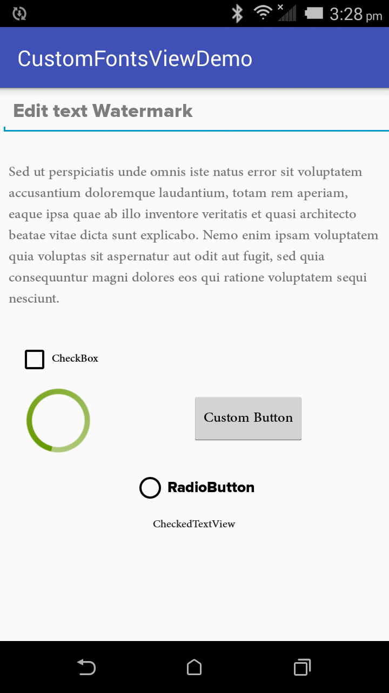

# Custom Font View



This library provides set of custom views which are easy to use to apply your custom font.

First of all place all your custom font files in directory  **assets/fonts**
For reference see below screenshot:


## Attributes

You will only need to use one attribute i.e. **fontName**

```java
custom:fontName="Your custom fontName with extension"
```
Here font file can be of any type **ttf** or **otf**

# Custom Views

####1. UITextView

```java
<com.vikasverma.customfontviews.UI.UITextView
    xmlns:custom="http://schemas.android.com/apk/res-auto"
		android:layout_width="wrap_content"
		android:layout_height="wrap_content"
		android:text="Demo Text"
		android:textSize="18sp"
		custom:fontName="AdobeArabic-Regular.otf"/>
```

####2. UICheckBox

```java
<com.vikasverma.customfontviews.UI.UICheckBox
    xmlns:custom="http://schemas.android.com/apk/res-auto"
		android:layout_width="wrap_content"
		android:layout_height="wrap_content"
		android:text="Demo Text"
		android:textSize="18sp"
		custom:fontName="AdobeArabic-Regular.otf"/>
```

####3. UIRadioButton

```java
<com.vikasverma.customfontviews.UI.UIRadioButton
    xmlns:custom="http://schemas.android.com/apk/res-auto"
		android:layout_width="wrap_content"
		android:layout_height="wrap_content"
		android:text="Demo Text"
		android:textSize="18sp"
		custom:fontName="AdobeArabic-Regular.otf"/>
```
####4. UIButton

```java
<com.vikasverma.customfontviews.UI.UIButton
    xmlns:custom="http://schemas.android.com/apk/res-auto"
		android:layout_width="wrap_content"
		android:layout_height="wrap_content"
		android:text="Demo Text"
		android:textSize="18sp"
		custom:fontName="AdobeArabic-Regular.otf"/>
```
####5. UIEditText

```java
<com.vikasverma.customfontviews.UI.UIEditText
    xmlns:custom="http://schemas.android.com/apk/res-auto"
		android:layout_width="wrap_content"
		android:layout_height="wrap_content"
		android:text="Demo Text"
		android:textSize="18sp"
		custom:fontName="AdobeArabic-Regular.otf"/>
```
####6. UICheckedTextView

```java
<com.vikasverma.customfontviews.UI.UICheckedTextView
    xmlns:custom="http://schemas.android.com/apk/res-auto"
		android:layout_width="wrap_content"
		android:layout_height="wrap_content"
		android:text="Demo Text"
		android:textSize="18sp"
		custom:fontName="AdobeArabic-Regular.otf"/>
```

Also you can change fonts programmatically as mentioned below:

Take reference of these view and call method as

```java
UITextView textView=new UITextView(this);
textView.setFontName("Helvetica.ttf");
```

Apart from above this library contains one move custom view i.e. **UIProgressBar** which can be used to show circular progress bar with color of your choice.

##UIProgressBar

To define your color for progress bar ring you can use attribute **ringColor** as mentioned below:

```java
<com.vikasverma.customfontviews.UI.UIProgressBar
		android:layout_width="wrap_content"
		android:layout_height="wrap_content"
		vikas:ringColor="@android:color/holo_green_dark"/>
```

## License

Copyright [2016] [Vikas Verma]

Licensed under the Apache License, Version 2.0 (the "License");
you may not use this file except in compliance with the License.
You may obtain a copy of the License at

    http://www.apache.org/licenses/LICENSE-2.0

Unless required by applicable law or agreed to in writing, software
distributed under the License is distributed on an "AS IS" BASIS,
WITHOUT WARRANTIES OR CONDITIONS OF ANY KIND, either express or implied.
See the License for the specific language governing permissions and
limitations under the License.